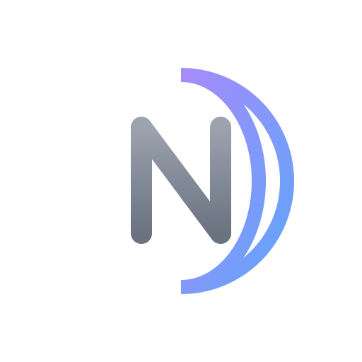

  
  

  <h1>Hello, I'm zAxn1e 👋</h1>
  
  <h3>💻 Developer & Game Enthusiast</h3>
  
  

    🌙 Member of <strong>NoctraDev</strong>
  

   

  

 

## About Me

Hi! I'm a developer who enjoys building small things that slowly grow into something bigger.  
I work across both **web** and **game** projects, but I don't really like to label myself as “full-stack” — I’m still learning, experimenting, and figuring things out as I go.

I’m interested in creating interactive experiences and tools that are fun or genuinely useful, even if they start simple.

 

## 🛠 What I usually work with

| Category | Technologies |
| :--- | :--- |
| **Languages** | Python, JavaScript, C#, Java, Lua |
| **Web** | HTML, CSS, React, Node.js |
| **Game Dev** | Unity, Roblox Studio |
| **Databases** | MySQL, PostgreSQL |
| **Tools** | VS Code, Git |

> *I don’t think of myself as an expert — just someone who enjoys building things, breaking things, and learning from both.*

 

## 📊 GitHub Stats

  
  

 

  
Thanks for stopping by!   I’m always happy to learn, share ideas, or collaborate on something interesting.

  
© 2026 zAxn1e • NoctraDev Team

